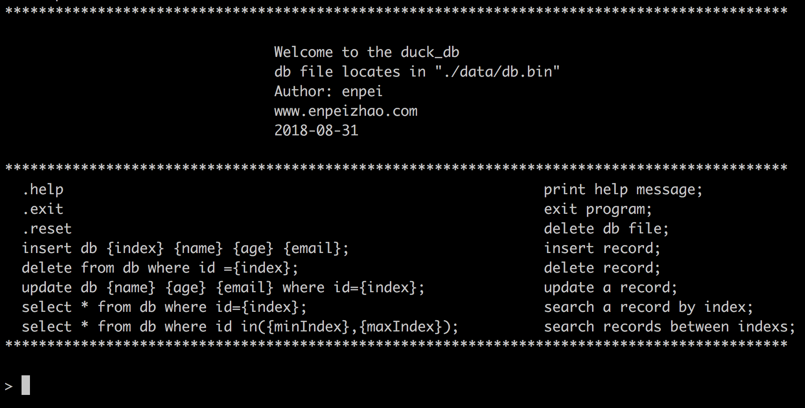
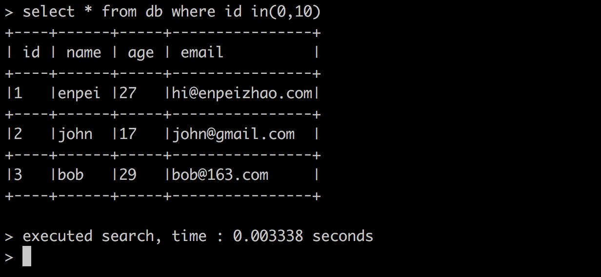
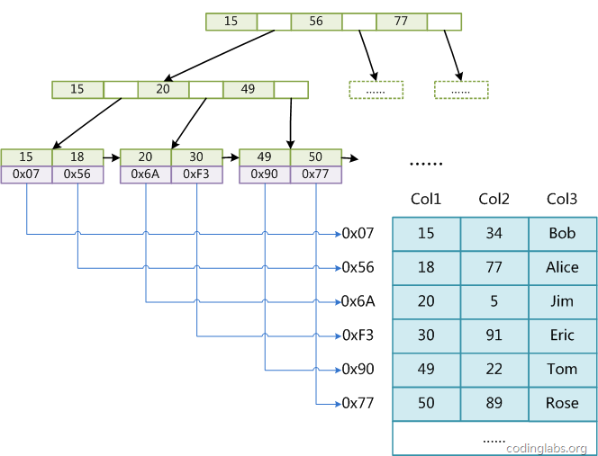
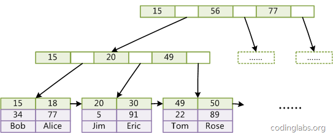
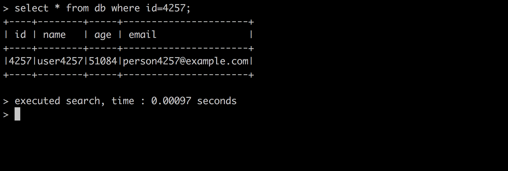
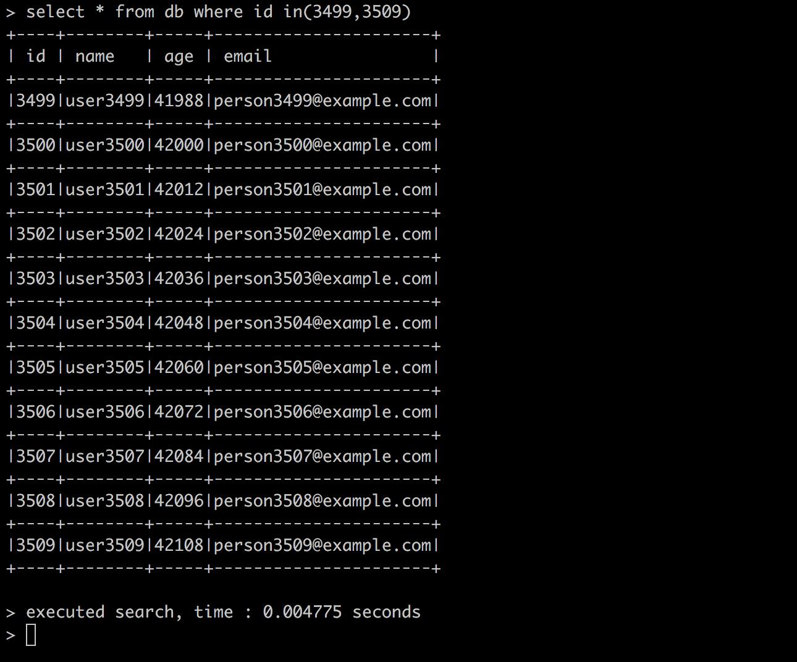
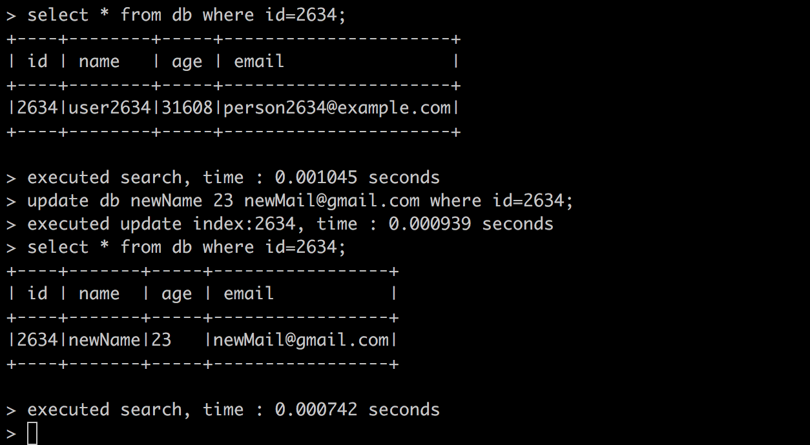
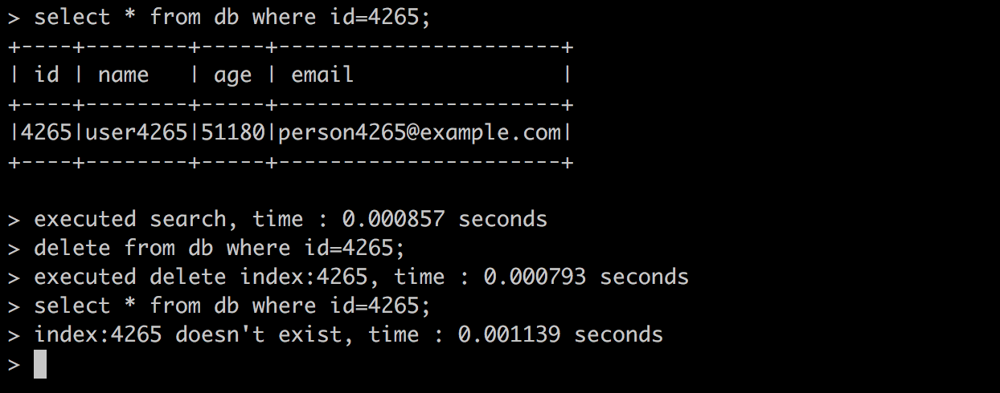

## c/c++ build a simple b+tree RDMS (use c/c++ to develop a small relational database based on B+ tree)


Development environment: ubuntu

1. Enter `make` to compile, enter `./duck_db` to run;
2. `make clean` clears files.
3. The directory where the database binary file is stored: ./data/db.bin


[TOC]

#### Purpose

> "What I cannot create, I do not understand." – [Richard Feynman](https://en.m.wikiquote.org/wiki/Richard_Feynman)

Just like this famous saying, the best way to understand a thing is to design and make it yourself. This article will introduce the development process of a simple relational database system (similar to MySQL, sqlite, etc.) to understand the basic working principles of relational databases. Call it duck_db.

Help interface:



The main features are as follows:

1. Use C/C++ to develop;
2. Basic CURD operations have been implemented, using console SQL:
   1. Create a new record (create), operate SQL: **insert db {index} {name} {age} {email};**
   2. Update record (update), operation statement: **update db {name} {age} {email} where id={index};**
   3. Single read record (read), operation statement: **select * from db where id={index};**
   4. Read in range, operation statement: **select * from db where id in({minIndex},{maxIndex});**
   5. Delete record (delete), operation statement: **delete from db where id ={index};**
3. The bottom layer uses B+ tree (B+ TREE) to build the index;
4. Use binary storage data table;
5. Custom table structure is not supported temporarily. The database table structure is fixed as: id, name, age, email, as shown in the figure:



#### Process

The following figure is the architecture diagram of sqlite:


With reference to the figure above, the main development steps are as follows:

1. Create a console dialogue interactive program (REPL: read-execute-print loop);
2. Create a simple lexical analyzer to parse SQL statements;
3. Write the CURD function to implement database addition, deletion, modification, and query operations;
4. Create a b+ tree index engine to perform database indexing and disk read and write operations. The data table will be stored in binary form.

##### Step 1: REPL (read-execute-print loop)

Use a character array (*userCommand) to accept user input, and constantly compare keywords to identify SQL statement commands:

code segment:

```c++
// REPL
void selectCommand(){
char *userCommand = new char[256];
while(true){
	// Get user input
	cin.getline(userCommand,256);
	if(strcmp(userCommand,".exit") == 0){
		// Exit system
		break;
    }else if(strcmp(userCommand,".help") == 0){
    	// help
    }else if(strcmp(userCommand,".reset") == 0){
    	// reset database
    }else if(strncmp(userCommand,"insert",6) == 0){
    	// insert record
    }else if(strncmp(userCommand,"delete",6) == 0){
    	// Delete Record	    	
    }else if(strncmp(userCommand,"select",6) == 0){
    	// read record
    }else if(strncmp(userCommand,"update",6) == 0){
    	// update record
    }else{
    	// error message
    }
}

}
```
##### Step 2: Lexical Analyzer

Use the sscanf function to implement basic SQL parsing, such as:

```c++
sscanf(userCommand,"insert db %d %s %d %s;",keyIndex, insertData->name,&(insertData->age),insertData->email);
```

Indicates that the analysis is similar to the following SQL statement, and other SQL operations are similar:

```sql
insert db 3 username 28 user@gmail.com;
```

##### Step 3: Table data structure

Custom table structure is not currently supported. The database table structure is fixed as: id (primary key), name, age, email:

```c++
struct value_t{
    char name[256]; // name
    int age; // age
    char email[256]; // email
};
```

##### Step 4: CURD function prototype

The prototype of the CURD function is as follows, we will improve these functions later:

```c++
// insert record
int insertRecord();
// Delete Record
int deleteRecord();
// Search records (according to index)
int searchRecord();
// Search records (range search)
int searchAll();
// update record
int updateRecord();
```

##### Step 5: B tree and B+ tree

###### 1. Index

Databases generally operate on massive amounts of data, which are stored on disk. Query is one of the most important functions of the database. We can compare the query process to searching words in the Oxford dictionary. We all hope to query data as fast as possible.


The above picture is the "Oxford Advanced Dictionary", which contains more than 80,000 words. Suppose I need to query the word "hash". We have two ways: one is to traverse from A->H one by one; the other is to click The way to show the red circle first find H, then look at the second letter of the word, then look at the third... Obviously we generally use the second way, and the letter in the red circle is the index (index) .

MySQL's official definition of index is: Index is a data structure that helps MySQL obtain data efficiently. Extract the main sentence of the sentence, you can get the essence of the index: the index is a data structure.

The most basic query algorithm is of course [sequential search](http://en.wikipedia.org/wiki/Linear_search) (linear search), this kind of algorithm with O(n) complexity is obviously Worse, with the development of computer science, we have invented [binary search](http://en.wikipedia.org/wiki/Binary_search_algorithm)(binary search), [binary search](http://en.wikipedia .org/wiki/Binary_search_tree) (binary tree search) and other algorithms. Each search algorithm can only be applied to a specific data structure. For example, binary search requires the retrieved data to be ordered, while binary tree search can only be applied to [binary search tree](http://en.wikipedia.org/ wiki/Binary_search_tree), but the organizational structure of the data itself cannot completely satisfy various data structures (for example, it is theoretically impossible to organize both columns in order at the same time). Therefore, in addition to the data, the database system also maintains Data structures that meet a specific search algorithm. These data structures reference (point to) data in a certain way, so that advanced search algorithms can be implemented on these data structures. This data structure is the index.


The figure above shows a possible indexing method. On the left is the data table. There are two columns of seven records. The leftmost is the physical address of the data record (note that logically adjacent records are not necessarily physically adjacent on the disk). In order to speed up the search of Col2, you can maintain a binary search tree as shown on the right. Each node contains an index key value and a pointer to the physical address of the corresponding data record, so that the binary search can be used to obtain within the complexity To the corresponding data.

| | Unsorted Array of rows | Sorted Array of rows | Tree of nodes |
| ------------- | ---------------------- | ------------ -------- | -------------------------------- |
| Pages contain | only data | only data | metadata, primary keys, and data |
| Rows per page | more | more | fewer |
| Insertion | O(1) | O(n) | O(log(n)) |
| Deletion | O(n) | O(n) | O(log(n)) |
| Lookup by id | O(n) | O(log(n)) | O(log(n) |

At present, most database systems and file systems use B-Tree or its variant B+Tree as the index structure, and no binary search tree or its evolutionary variety [红黑树](http://en.wikipedia.org/wiki /Red-black_tree) (red-black tree), please refer to this article: http://www.cnblogs.com/serendipity-fly/p/9300360.html

###### Two, B tree and B+ tree

Wikipedia defines B-tree as "In computer science, B-tree is a tree-like data structure that can store data, sort it, and allow O(log n) time complexity. Run the data structure for searching, reading sequentially, inserting and deleting. B-tree, in general, is a binary search tree in which a node can have more than 2 child nodes. Unlike self-balancing binary search trees, B-trees are The system optimizes **read and write operations of large blocks of data**. The B-tree algorithm reduces the intermediate process experienced when locating records, thereby speeding up access. It is commonly used in **databases** and **file systems* *."

**B tree**

**B-tree** can be seen as an extension of the 2-3 search tree, that is, it allows each node to have M-1 child nodes.

-The root node has at least two child nodes;
-Each node has M-1 keys, and they are arranged in ascending order;
-The value of the child node located in M-1 and M key is between the value corresponding to M-1 and M key;
-Other nodes have at least M/2 child nodes;

The figure below is a B-tree of order M=4:


The following is to insert sequentially into the B tree

**6 10 4 14 5 11 15 3 2 12 1 7 8 8 6 3 6 21 5 15 15 6 32 23 45 65 7 8 6 5 4**

Demonstration animation:


**B+Tree**

**B+** tree is a kind of deformed tree of B tree. The difference between it and B tree is:

-A node with k sub-nodes must have k key codes;
-Non-leaf nodes only have an index function, and the information related to records is stored in the leaf nodes.
-All leaf nodes of the tree constitute an ordered linked list, which can traverse all records in the order of key code sorting.

As shown in the figure below, it is a B+ tree:


The following is to insert sequentially into the B+ tree

**6 10 4 14 5 11 15 3 2 12 1 7 8 8 6 3 6 21 5 15 15 6 32 23 45 65 7 8 6 5 4**

Demonstration animation:


The difference between B and B+ trees is that the non-leaf nodes of the B+ tree only contain navigation information and do not contain actual values. All leaf nodes and connected nodes are connected by a linked list, which is convenient for interval search and traversal.

**The advantages of B+ trees are:**

-Since the B+ tree does not contain data information on internal nodes, more keys can be stored in the memory page. Data storage is more compact, with better spatial locality. Therefore, access to the data associated on the leaf node also has a better cache hit rate.
-The leaf nodes of the B+ tree are all linked, so the convenience of the entire tree only needs to traverse the leaf nodes once. And because the data are arranged in order and connected, it is convenient for interval searching and searching. The B-tree requires recursive traversal of each layer. Adjacent elements may not be adjacent in memory, so cache hits are not as good as B+ trees.

But the B-tree also has advantages. Its advantage is that since each node of the B-tree contains a key and a value, the frequently accessed elements may be closer to the root node, so the access is faster. The following is the difference diagram between B tree and B+ tree:


###### Third, MySQL MyISAM index and InnoDB index

**MyISAM Index**

The MyISAM engine uses B+Tree as the index structure, and the data field of the leaf node stores the address of the data record. The following figure is the schematic diagram of MyISAM index:




There are three columns in the table. Assuming that we use Col1 as the primary key, the above figure shows the primary key of a MyISAM table. It can be seen that the MyISAM index file only saves the address of the data record.

**InnoDB Index**

Although InnoDB also uses B+Tree as an index structure, the specific implementation is completely different from MyISAM.

The first major difference is that InnoDB's data files are themselves index files. From the above, the MyISAM index file and the data file are separated, and the index file only saves the address of the data record. In InnoDB, the table data file itself is an index structure organized by B+Tree, and the leaf node data field of this tree saves complete data records. The key of this index is the primary key of the data table, so the InnoDB table data file itself is the primary index.




**This article will simulate the InnoDB engine:**

Because the logic of B+ number implementation is more complicated, the following code is the function prototype. For the complete code, please see the address at the end of the article:

```c++
// Constructor
bplus_tree(const char *path, bool force_empty = false);
/* abstract operations */
// search for
int search(const key_t& key, value_t *value) const;
// Range search
int search_range(key_t *left, const key_t &right,
                 value_t *values, size_t max, bool *next = NULL) const;
// delete
int remove(const key_t& key);
// New record
int insert(const key_t& key, value_t value);
// update
int update(const key_t& key, value_t value);
```
###### Fourth, file IO

The leaf node data field of B+tree saves complete data records. We need to save the data to disk and construct the corresponding function for file IO operations. Here is part of the code:

```c++
/* read block from disk */
template<class T>
int map(T *block, off_t offset) const
{
    return map(block, offset, sizeof(T));
}
/* write block to disk */
template<class T>
int unmap(T *block, off_t offset) const
{
    return unmap(block, offset, sizeof(T));
}
```

##### Step 6: Improve the CURD function and initialize the system

Take the insert record function (C operation) as an example:

```c++
// insert
int insertRecord(bplus_tree *treePtr,int *index, value_t *values){
	bpt::key_t key;
    //Conversion format
	intToKeyT(&key,index);
	return (*treePtr).insert(key, *values);
}
```

The function parameters are `bplus_tree *treePtr, int *index, value_t *values`, which are B+ tree pointer, index pointer, and parameter pointer for inserting records.

Create a startup function `initialSystem()` to call `main()`:

```C++
// Create a B+ tree pointer
bplus_tree *duck_db_ptr;
// initial
void initialSystem(){
	// step 1: print help information
	printHelpMess();
	// step 2: Initialize the B+ tree from the file, if there is no file on the disk, a new one will be created automatically
	bplus_tree duck_db(dbFileName, (!is_file_exist(dbFileName)));
    // Pass the address to the pointer
	duck_db_ptr = &duck_db;
	// step 3: Enter the REPL SQL command parser (insert, delete, update, search)
	selectCommand();
}
```

main function

``` c++
int main(int argc, char *argv[])
{
    // start the system
	initialSystem();
}
```

#### Test

Use [rspec](http://rspec.info/) to test duck_db, we will insert 5000 pieces of data:

```ruby
it'inserting test 'do
  script = (1..5000).map do |i|
    "insert db #{i} user#{i} #{i*12} person#{i}@example.com"
  end
  script << ".exit"
  result = run_script(script)
  expect(result.last(2)).to match_array([
    ">insert",
    "> bye!",
  ])
end
```

Enter `bundle exec rspec`, the result is as follows:


It took 28.71 seconds in total, and it took 0.005742 seconds to insert each record on average, and a 5.1MB data file was generated:


Query a piece of data randomly:




Print a range:



Update a record with id=2634:



Delete the record with id=4265:



#### Evaluation

duck_db uses the B+ tree to implement the basic CURD operations of the database, but there is still a big gap from the actual database, such as:

1. Unable to create a custom table;
2. Does not support transaction processing, IO optimization;
3. Remote login database is not supported, it can only be used locally;
4. CURD advanced functions such as functions, constraints, and table operations are not supported;
5. More advanced features, etc.

#### Complete code

The project code has been hosted on GitHub: https://github.com/enpeizhao/duck_db

